# CS205 C/C++ Program Design - Project 2

-----
**Name**: 秦禹洲(Qin Yuzhou)  
**SID**: 12110601  
**Code**: <https://github.com/QinYuzhou/C-Program-Design-Project-2>  

## Part 1 - Analysis

-----
&emsp;&emsp;这个Project的要求是实现一个小型的计算器，可以支持输入一个算式，输出这个算式的运算结果，并且支持在算式中加入括号，支持变量赋值，支持高精度运算，并且支持一些数学函数。

### 使用结构体来存储一个数字并进行计算

&emsp;&emsp;为了实现高精度的运算，我使用了一个结构体来存储一个数字，我建立了一个结构体$Big\_number$,在结构体中有四个参数$positive$、$length$、$num$和$power$，其中$num$是一个_int_类型的指针，$num_i$代表该数字从右向左数第$i+1$位的数字是多少，$length$是一个整数，代表$num$的大小，$positive$是一个布尔类型变量，代表该数字的正负性，$power$是一个整数，代表该数在科学记数法下十的幂，所以原数可以表示为$$(positive?1:-1)*(\sum^{length-1}_{i=0}{num_{i}*10^i})*10^{power}$$

```cpp
struct Big_number
{
    bool positive; //该数字的正负性,positive=true则为正数,反之为负数
    int length;    //数字的位数/长度
    int *num;      //数字的每一位,其中num[0]代表各位,num[length-1]代表最高位
    int power;     //科学计数法之后10的幂
    //该数字为(positive)(num)*(10^power)
}
```

#### 构造函数与析构函数

&emsp;&emsp;我在程序中设计了四种构造函数和一个析构函数。
&emsp;&emsp;第一种是默认构造函数，调用默认构造函数会将该数设为0。

```cpp
Big_number::Big_number() //构造函数,默认初值为0
{
    positive = true;
    length = 1;
    power = 0;
    num = new int[1];
    num[0] = 0;
}
```

&emsp;&emsp;第二种是转换构造函数，可以将一个*long long*类型的数字转化为我构造的*Big_number*类型，具体实现方法为每次取该数的末位，放在*Big_number*类型的首位，之后删除掉该数的末位。

```cpp
Big_number::Big_number(long long number) //将long long转化为Big_Number
{
    //判断number的正负性
    if (number < 0)
    {
        number *= -1;
        positive = false;
    }
    else
    {
        positive = true;
    }
    //去除number的后导0
    power = 0;
    while (number && number % 10 == 0)
    {
        number /= 10;
        power++;
    }
    length = 0;
    long long x = number;
    while (x) //计算位数
    {
        x /= 10;
        length++;
    }
    if (!length)
    {
        num = new int[1];
        length = 1;
    }
    else
    {
        num = new int[length];
        for (int i = 0; i < length; i++)
        {
            num[i] = number % 10;
            number /= 10;
        }
    }
}
```

&emsp;&emsp;第三种是赋值构造函数，因为*Big_number*中的*num*变量是一个指针，如果用C++默认的复制构造函数的话，因为默认的复制构造函数是进行浅拷贝，所以会出现两个数字的*num*指向同一个位置的情况，会发生错误，故我自己设计了复制构造函数，并使用了深拷贝的方法。

```cpp
Big_number::Big_number(const Big_number &number) //将Big_Number赋值给当前数
{
    positive = number.positive;
    length = number.length;
    num = new int[length];
    for (int i = 0; i < length; i++)
        num[i] = number.num[i];
    power = number.power;
}
```

&emsp;&emsp;第四种是右值的赋值构造函数，也应用了深拷贝的方法，构造了右值的拷贝函数。

```cpp
Big_number::Big_number(Big_number &&number) //将右值深拷贝
{
    positive = number.positive;
    length = number.length;
    num = new int[length];
    for (int i = 0; i < length; i++)
        num[i] = number.num[i];
    power = number.power;
}
```

&emsp;&emsp;同时因为我的结构体中的*num*变量是指针，所以我写了析构函数，当对象结束其生命周期后，释放内存。

```cpp
Big_number::~Big_number() //析构函数
{
    if (num != NULL)
        delete[] num;
}
```

#### 拷贝函数与比较函数

&emsp;&emsp;因为重写了*Big_number*的复制构造函数和右值的赋值构造函数，所以我也重写了该结构体的拷贝函数，也是应用了深拷贝的方法,其中调用的clone是我写的一个用来深度拷贝的函数。

```cpp
void Big_number::clone(const Big_number &number) //将number复制
{
    positive = number.positive;
    length = number.length;
    if (num != NULL)
        delete[] num;
    num = new int[length];
    for (int i = 0; i < length; i++)
        num[i] = number.num[i];
    power = number.power;
    return;
}
Big_number &Big_number::operator=(const Big_number &number) //深度拷贝
{
    if (this == &number)
        return (*this);
    clone(number);
    return (*this);
}
Big_number &Big_number::operator=(Big_number &&number) //右值拷贝时也进行深度拷贝
{
    if (this == &number)
        return (*this);
    clone(number);
    return (*this);
}

```

&emsp;&emsp;比较是数字经常需要使用的操作，所以我重写了比较函数，即重载了大于、小于、大于等于、小于等于和等于函数。其中的大于、大于等于、小于等于和等于主要都是依靠小于来进行的。而小于号的逻辑为先比较两个数的正负性，若一正一负则正的更大；若全为正数则比较数字位，数字位更大的更；若全为负数也比较数字位，数字位更小的更大。

```cpp
bool Big_number::operator<(const Big_number &number) const //比较两个数的大小关系,若前者小于后者,返回true
{
    if (positive != number.positive) //一正一负
    {
        return !positive; //若左侧为负数，则返回true，否则返回true
    }
    if (positive) //全为正数
    {
        if (length == 1 && num[0] == 0)
            return true;
        if (number.length == 1 && number.num[0] == 0)
            return false;
        if (length + power == number.length + number.power) //最高位数相同
        {
            for (int i = 1; i <= length && i <= number.length; i++) //从最高位依次比较，若不相等则返回大小关系
            {
                if (num[length - i] == number.num[number.length - i])
                    continue;
                return num[length - i] < number.num[number.length - i];
            }
            return length < number.length;
        }
        return length + power < number.length + number.power;
    }
    else //全为负数
    {
        if (length + power == number.length + number.power) //最高位数相同
        {
            for (int i = 1; i <= length && i <= number.length; i++) //从最高位依次比较，若不相等则返回大小关系
            {
                if (num[length - i] == number.num[number.length - i])
                    continue;
                return num[length - i] > number.num[number.length - i];
            }
            return length > number.length;
        }
        return length + power > number.length + number.power;
    }
}
bool Big_number::operator>(const Big_number &number) const //比较两个数的大小关系,若前者大于后者,返回true
{
    return number<(*this);
}
bool Big_number::operator<=(const Big_number &number) const //比较两个数的大小关系,若前者小于等于后者,返回true
{
    return !((*this)>number);
} 
bool Big_number::operator>=(const Big_number &number) const //比较两个数的大小关系,若前者大于等于后者,返回true
{
    return !((*this)<number);
}
bool Big_number::operator==(const Big_number &number) const //比较两个数的大小关系,若前者等于后者,返回true
{
    return !(((*this)>number)||((*this)<number));
}
```

#### 将字符串转化为数字存储并判断是否合法

&emsp;&emsp;因为需要读入高精度的数字，有可能读入的数字就是超出*long long*的范围，所以一般使用字符串存储，所以我设计了一个函数用来将一个字符串转化为*Big_number*类型，若转化成功则返回true，否则返回false，这个函数与我在Project1中写的函数功能相同，故直接使用了该函数。

```cpp
bool get_E_location(std::string str, int &e) //找到'e'在字符串中的位置,并储存在e中,如果多于1个就返回false,如果不存在则使e=-1
{
    e = -1;
    for (int i = 0; i < str.size(); i++)
    {
        if (str[i] == 'e')
        {
            if (e == -1)
            {
                e = i;
            }
            else
            {
                return false;
            }
        }
    }
    return true;
}
bool get_point_location(std::string str, int &p) //找到'.'在字符串中的位置,并储存在p中,如果多于1个就返回false,如果不存在则使p=-1
{
    p = -1;
    for (int i = 0; i < str.size(); i++)
    {
        if (str[i] == '.')
        {
            if (p == -1)
            {
                p = i;
            }
            else
            {
                return false;
            }
        }
    }
    return true;
}
bool isDigit(std::string str) //判断是否全由数字组成
{
    for (char c : str)
    {
        if (c < '0' || c > '9')
            return false;
    }
    return true;
}
bool to_int(std::string str, int &num) //将字符串转化为数字并储存在num里,若字符串格式不对则返回false
{
    if (!str.size())
    {
        return false;
    }
    bool is_positive = true;
    if (str[0] == '-')
    {
        is_positive = false;
        str = str.substr(1);
        if (!str.size())
        {
            return false;
        }
    }
    if (!isDigit(str))
        return false;
    num = 0;
    for (int i = 0; i < str.size(); i++)
    {
        num *= 10;
        num += str[i] - '0';
    }
    if (!is_positive)
    {
        num *= -1;
    }
    return true;
}
void Big_number::clear() //将数字归零
{
    positive = true;
    length = 1;
    power = 0;
    delete[] num;
    num = new int[1];
    num[0] = 0;
    return;
}
bool Big_number::change_to(std::string str) //将string str转化为数字,若格式不对返回false
{
    int e_location, p_location, pointer;  // e_location:字符'e'所在的位置,如果不存在'e'时为-1;p_location:字符'.'所在的位置,如果不存在'.'时为-1
    if (!get_E_location(str, e_location)) //如果有多个'e',格式错误
    {
        goto FORMAT_ERROR;
    }
    if (e_location != -1) //有字'e',是科学计数法,先处理科学计数法下10的幂
    {
        if (!to_int(str.substr(e_location + 1), power)) //字符'e'后面的不是整数
        {
            goto FORMAT_ERROR;
        }
        str = str.substr(0, e_location);
    }
    else
    {
        power = 0;
    }
    //继续处理科学计数法中前面的数字
    if (str[0] == '-') //先判断该数的正负性
    {
        positive = false;
        str = str.substr(1);
    }
    else
    {
        positive = true;
    }
    if (!str.size()) // str长度为0,格式错误
    {
        goto FORMAT_ERROR;
    }
    if (!get_point_location(str, p_location)) //如果有多个小数点,格式错误,将数字设为0,返回false
    {
        goto FORMAT_ERROR;
    }
    if (p_location != -1) //存在小数点,将该数字改为整数乘十的幂,并更新power
    {
        if (p_location == 0 || p_location == str.size() - 1) //小数点在该数的第一位获最后一位,格式错误,将数字设为0,返回false
        {
            goto FORMAT_ERROR;
        }
        power -= str.size() - p_location - 1;                         //小数点在第p位,将该数乘以10^(l-p-1),并更新power
        str = str.substr(0, p_location) + str.substr(p_location + 1); //更新str
    }
    if (!isDigit(str)) // str中有数字之外的字符,格式错误,将数字设为0,返回false
    {
        goto FORMAT_ERROR;
    }
    //去除该数字的前导0,pointer是该数最高的非0位
    pointer = 0;
    while (pointer < str.size() && str[pointer] == '0')
        pointer++;
    if (pointer == str.size()) //该数所有数字都是0,将该数设为0,返回true
    {
        clear();
        return true;
    }
    str = str.substr(pointer); //更新str
    //去除该数字末尾的0,并更新power,pointer是该数最小的非0位
    pointer = str.size() - 1;
    while (pointer >= 0 && str[pointer] == '0')
        pointer--;
    power += str.size() - pointer - 1; //更新power
    str = str.substr(0, pointer + 1);  //更新str
    //存储这个数字
    length = str.size();
    delete[] num;
    num = new int[length];
    for (int i = 0; i < length; i++)
        num[i] = str[length - i - 1] - '0';
    return true;
FORMAT_ERROR: //该数格式错误,将该数清零并返回false
    clear();
    return false;
}
```

#### 基础的数字运算

&emsp;&emsp;我重载了"+"、"-"、"*"、"/"运算符，用来计算两个数字加减乘除的结果。

##### 加法

&emsp;&emsp;在加法计算中，我首先判断了两个数字的正负性是否相同，如果相同，则将两个数字的数位作为答案存储起来，在处理答案的*power*和*positive*后返回答案；如果两个数字的正负性不同，则将两个数位相减，之后通过判断两数数位相减后是否为负，来判断两个加数的绝对值的大小关系，更新答案的正负性和*power*并返回答案。

```cpp
Big_number Big_number::operator+(const Big_number &number) const //进行加法计算
{
    Big_number result;
    if (positive == number.positive) //符号相同,将数字位相加
    {
        result.positive = positive;
        int *digits;                                                                                                       //存储加起来之后的数字位结果
        int len;                                                                                                           // digits数组的长度
        int min_digit = std::min(power, number.power), max_digit = std::max(length + power, number.length + number.power); //计算出加法后最低位和最高位的位置
        len = max_digit - min_digit + 1;                                                                                   //计算出数位加法后的位数
        digits = new int[len];
        memset(digits, 0, len * sizeof(int)); //将digits清零
        for (int i = 0; i < length; i++)
        {
            digits[power + i - min_digit] += num[i];
        }
        for (int i = 0; i < number.length; i++)
        {
            digits[number.power + i - min_digit] += number.num[i];
        }
        for (int i = 0; i < len - 1; i++)
        {
            digits[i + 1] += digits[i] / 10;
            digits[i] %= 10;
        }
        result.power = 0;
        while (result.power < len && digits[result.power] == 0) //去除后导0
        {
            result.power++;
        }
        if (result.power == len) // result为0
        {
            result.clear();
            return result;
        }
        while (digits[len - 1] == 0) //去除前导0
        {
            len--;
        }
        result.length = len - result.power;
        delete[] result.num;
        result.num = new int[result.length];
        for (int i = 0; i < result.length; i++)
        {
            result.num[i] = digits[i + result.power];
        }
        result.power += min_digit;
        delete[] digits;
    }
    else //符号位相反
    {
        int *digits;                                                                                                       //存储加起来之后的数字位结果
        int len;                                                                                                           // digits数组的长度
        int min_digit = std::min(power, number.power), max_digit = std::max(length + power, number.length + number.power); //计算出加法后最低位和最高位的位置
        len = max_digit - min_digit + 1;                                                                                   //计算出数位加法后的位数
        digits = new int[len];
        memset(digits, 0, len * sizeof(int)); //将digits清零
        for (int i = 0; i < length; i++)
        {
            digits[power + i - min_digit] += num[i] * (positive ? 1 : -1);
        }
        for (int i = 0; i < number.length; i++)
        {
            digits[number.power + i - min_digit] += number.num[i] * (number.positive ? 1 : -1);
        }
        for (int i = 0; i < len - 1; i++)
        {
            if (digits[i] < 0)
            {
                digits[i] += 10;
                digits[i + 1]--;
            }
        }
        result.power = 0;
        while (result.power < len && digits[result.power] == 0) //去除后导0
        {
            result.power++;
        }
        if (result.power == len) // result为0
        {
            result.clear();
            return result;
        }
        while (digits[len - 1] == 0) //去除前导0
        {
            len--;
        }
        result.positive = true;
        if (digits[len - 1] < 0) //该数为负数,将每一位反转
        {
            result.positive = false;
            for (int i = result.power; i < len; i++)
                digits[i] *= -1;
            for (int i = 0; i < len - 1; i++)
            {
                if (digits[i] < 0)
                {
                    digits[i] += 10;
                    digits[i + 1]--;
                }
            }
        }
        while (digits[len - 1] == 0) //去除前导0
        {
            len--;
        }
        result.length = len - result.power;
        delete[] result.num;
        result.num = new int[result.length];
        for (int i = 0; i < result.length; i++)
        {
            result.num[i] = digits[i + result.power];
        }
        result.power += min_digit;
        delete[] digits;
    }
    return result;
}

```

##### 减法

&emsp;&emsp;因为$A-B=A+(-B)$,所以我的减法函数是将减数的正负性颠倒后与被减数相加，并将得到的结果作为答案返回。

```cpp
Big_number Big_number::operator-(const Big_number &number) const //进行减法计算,a-b就是a+(-b)
{
    Big_number copy;
    copy.clone(number);
    copy.positive = !copy.positive;
    return (*this) + copy;
}
```

##### 乘法

&emsp;&emsp;普通的乘法操作是直接将两个数字的数位依次相乘，时间复杂度是$O(n^2)$的，我使用FFT优化了乘法操作，将时间复杂度优化为$O(nlogn)$。FFT是快速傅立叶变换，可以用来计算多项式乘法，其主要思想为用$O(nlogn)$的时间将一个函数由系数表达式转化为点值表达式，之后用$O(n)$的时间将点值表达式的值相乘，最后用$O(nlogn)$的时间将点值表达式转化为系数表达式，就可以得到两个多项式相乘的结果。不难发现，将$x=10$带入系数表示法就可以得到相乘之后的答案。其中FFT利用了单位根的相关性质，需要使用复数计算，过于复杂，所以我最后采用了NTT即快速数论变换，用与单位根性质相似的元根代替了单位根，并以998244353为模数，通过简略计算可知基本可以满足结果在一百万位之内的乘法，所以基本可以满足绝大多数的乘法需求。代码中的mutiply函数就是我应用NTT写的多项式乘法函数，其具体实现在FFT.cpp文件中

```cpp
Big_number Big_number::operator*(const Big_number &number) const //进行乘法计算
{
    Big_number result;
    int *digits;
    int len;
    result.positive = !(positive ^ number.positive);
    mutiply(num, length, number.num, number.length, digits, len);
    for (int i = 0; i < len - 1; i++)
    {
        digits[i + 1] += digits[i] / 10;
        digits[i] %= 10;
    }
    result.power = 0;
    while (result.power < len && digits[result.power] == 0) //去除后导0
    {
        result.power++;
    }
    if (result.power == len)
    {
        result.clear();
        return result;
    }
    while (digits[len - 1] == 0) //去除前导0
    {
        len--;
    }
    result.length = len - result.power;
    delete[] result.num;
    result.num = new int[result.length];
    for (int i = 0; i < result.length; i++)
    {
        result.num[i] = digits[i + result.power];
    }
    delete[] digits;
    result.power += power + number.power;
    return result;
}
```

##### 除法

&emsp;&emsp;除法我是用的牛顿迭代的方式完成的，牛顿迭代是用来逼近$f(x)=0$的根的一个方法，其主要思路为，首先选取一个近似值$x_0$，之后过点$(x_0,f(x_0))$作切线，其与x轴的交点为一次近似值，以此类推不断迭代就可以得到$f(x)=0$的根的近似值，且这种算法的近似速度更快，比我原本使用二分答案有更快的近似速度。我在计算$a/b$的答案时，首先用牛顿迭代法计算出$1/b$的值，之后将$1/b$的值与$a$相乘就是答案。在计算$1/b$时，令$f(x)=x^{-1}+b$,所以$f(x)=0$的根就是$x=1/b$我首先令$x_0=10^{-lgb-1}$,之后再通过$x_{n+1}=2x_n-bx_n^2$不断迭代，直到新结果与旧结果之间的差非常小时停止迭代，这种迭代方法仅需要加法减法和乘法就可以完成，非常方便，最后将得到的答案保留100位有效数字后返回。其中的*fixed*函数就是我写的一个保留100位有效数字的函数。

```cpp
void Big_number::fixed() //若数字的有效数字大于100位，则将其改为100位
{
    if (length <= 100)
        return;
    if (num[length - 101] >= 5)
    {
        num[length - 100]++;
        int now = length - 100;
        while (now < length - 1 && num[now] == 10)
        {
            num[now + 1] += num[now] / 10;
            num[now] %= 10;
            now++;
        }
        if (num[now] == 10)
        {
            power += length;
            delete[] num;
            num = new int[1];
            length = 1;
            num[0] = 1;
            return;
        }
    }
    int new_len = 100;
    while (new_len > 0 && num[length - new_len] == 0) //去除后导0
    {
        new_len--;
    }
    if (!new_len)
    {
        clear();
        return;
    }
    int *digits = new int[new_len];
    for (int i = 0; i < new_len; i++)
    {
        digits[i] = num[length - new_len + i];
    }
    power += length - new_len;
    length = new_len;
    delete[] num;
    num = digits;
    return;
}
Big_number Big_number::operator/(const Big_number &number) const //通过牛顿迭代实现
{
    Big_number result=Big_number(0);
    Big_number new_result=Big_number(1);
    new_result.power=-(number.power+number.length);
    Big_number eps;
    eps.change_to("1e-105");
    while(abs(result-new_result)>eps)
    {
        result=new_result;
        new_result=result.multiply()-number*(result*result);
    }
    result=new_result*(*this);
    result.fixed();
    return result;
}
```

#### 一些其他数学函数的实现

&emsp;&emsp;除了正常的加减乘除运算外，我还实现了一些其他数学函数，即开根，乘方，较大值，较小值和绝对值函数。

##### 开根

&emsp;&emsp;我的开根函数主要是应用二分答案的方法来写的，我首先通过不断倍增，找到答案的大致范围$[l,r]$，之后利用二分答案的方法，每次取$mid=\frac{l+r}{2}$若$mid$比正确答案大，则正确答案在$[l,mid]$中，否则正确答案在$[mid,r]$中，以此类推直到范围变得足够小，之后用fixed函数保留100位有效数字。之所以使用二分答案而非牛顿迭代的方法，是因为牛顿迭代法的迭代式为$x_{n+1}=\frac{x_n}{2}+\frac{a}{2x_n}$，需要使用除法，而除法本身已经使用了牛顿迭代法，感觉用两次之后时间会比较慢。

```cpp
Big_number Big_number::sqrt() const //返回开根的结果
{
    Big_number l, r;
    l = Big_number(0);
    r = Big_number(1);
    if ((*this) < Big_number(0))
        return Big_number(0);
    while ((r * r) < (*this))
    {
        l = r;
        r = (r * 2);
    }
    int cnt = 0;
    while (cnt < 350)
    {
        Big_number mid = (l + r);
        mid = mid.half();
        if ((*this) < (mid * mid))
        {
            r = mid;
        }
        else
        {
            l = mid;
        }
        cnt++;
    }
    l.fixed();
    return l;
}
```

##### 乘方

&emsp;&emsp;实现$a^b$,首先判断b是否为正数，若b为负数，则先计算$a^{-b}$,最后返回$\frac{1}{a^{-b}}$,计算$a^b$的主要思路则是先计算出b在二进制下的表达式，之后通过不断对a进行开根和平方再相乘的办法一点一点逼近$啊a^b$。如当$b=3.5$,$a^b=a^{3.5}=a^2*a^1*a^{\frac{1}{2}}$。

```cpp
Big_number Big_number::pow(const Big_number &number) const //返回该数的number次方
{
    bool flag = false;
    Big_number result = Big_number(1);
    Big_number index = Big_number(1);
    Big_number eps;
    eps.change_to("1e-105");
    Big_number now;
    now = (*this);
    Big_number copy;
    copy = number;
    if (!number.positive)
    {
        flag = true;
        copy.positive = true;
    }
    while (index < number)
    {
        index = index.multiply();
        now = (now * now);
    }
    index.fixed();
    now.fixed();
    while (copy>eps)
    {
        if (index <= copy)
        {
            copy = (copy - index);
            result = (result * now);
        }
        index = index.half();
        now = now.sqrt();
    }
    if (flag)
        return Big_number(1) / result;
    return result;
}
```

##### 较大值

&emsp;&emsp;通过调用比较函数比较两个数的大小，返回较大的数字。

```cpp
Big_number max(const Big_number &number1, const Big_number &number2) //返回较大值
{
    if (number1 < number2)
        return number2;
    return number1;
}
```

##### 较小值

&emsp;&emsp;通过调用比较函数比较两个数的大小，返回较小的数字。

```cpp
Big_number min(const Big_number &number1, const Big_number &number2) //返回较小值
{
    if (number1 < number2)
        return number1;
    return number2;
}
```

##### 绝对值

&emsp;&emsp;将该数克隆并将*positive*设为true并返回，得到该数的绝对值。

```cpp
Big_number abs(const Big_number &number) //返回绝对值
{
    Big_number result;
    result.clone(number);
    result.positive = true;
    return result;
}
```

#### 数字的输出

&emsp;&emsp;我重写了输出流用来输出*Big_number*类型的变量。并且当输出位数大于30位时，会使用科学计数法表示。

### 表达式的计算

&emsp;&emsp;首先定义了四个全局变量$formula$，$match$，$have\_problem$，$variables$，其中$formula$是一个字符串，用来存储每次输入的公式，$match$是一个整数指针，用来存储括号匹配的结果，若$match_i=j$说明$formula_i$是一个右括号，与$formula_i$相对应的左括号是$formula_j$,$have\_problem$是一个布尔类型变量$have\_problem=true$说明输入的公式存在格式问题，$variables$是一个$map$，将一个$string$和一个$Big\_number$对应，代表变量的名字和变量对应的数字。

#### 括号匹配

&emsp;&emsp;在输入一个表达式后，先用$remove\_space$函数删除表达式中的空格。然后调用$parentheses\_match$函数来进行括号匹配，$parentheses\_match$函数的主要逻辑为从头开始遍历$formula$,每次遇到左括号就把左括号的位置推入栈中，每次遇到右括号就取出栈顶的元素，并更新$match$数组。如果在遍历过程中出现右括号匹配不到对应左括号，或者匹配后发现栈中还有元素剩余，说明表达式的括号匹配存在问题，返回false，否则返回true。

```cpp
bool parentheses_match() //返回括号匹配的结果，若formula[i]是右括号,match[i]为其对应的左括号位置
{
    std::stack<int> stk;
    if (match != NULL)
        delete[] match;
    match = new int[formula.size()];
    memset(match, -1, sizeof(int) * formula.size());
    for (int i = 0; i < formula.size(); i++)
    {
        if (formula[i] == ')')
        {
            if (stk.empty())
                return false;
            match[i] = stk.top();
            stk.pop();
        }
        else if (formula[i] == '(')
        {
            stk.push(i);
        }
    }
    if (stk.empty())
        return true;
    return false;
}
```

#### 变量赋值

&emsp;&emsp;之后判断这个表达式是否是一个变量赋值语句，判断方法为检测表达式中是否有等号，若存在等号，则先调用$check\_legitimacy$函数检测等号左侧是否符合变量命名规范，即首字母为小写字母且变量名中只含有小写字母、数字和下划线。若变量名符合命名规范则继续调用$calculate$函数计算等号右侧的值并用$variables$将变量名和数值联系起来，返回true代表这是一个成功的变量命名。若变量名不符合命名规范，则将$have\_problem$变量改为true并返回true代表这虽然是一个变量命名语句却存在格式问题。

```cpp
bool check_legitimacy(std::string variable)//检查变量名是否符合规范
{
    if(variable[0]<'a'||'z'<variable[0])
        return false;
    for(char c: variable)
    {
        if('0'<=c&&c<='9')
            continue;
        if('a'<=c&&c<='z')
            continue;
        if('a'=='_')
            continue;
        return false;
    }
    return true;
}
bool variable_define() //判断这是否是一个赋值语句,如果是的话返回true并进行赋值,否则返回false
{
    for (int i = 0; i < formula.size(); i++)
        if (formula[i] == '=')
        {
            if(!check_legitimacy(formula.substr(0,i)))
            {
                return true;
            }
            Big_number value = calculate(i + 1, formula.size() - 1);
            variables.insert_or_assign(formula.substr(0, i), value);
            return true;
        }
    return false;
}

```

#### 一些数学常量

&emsp;&emsp;在计算器中引入了两个数学常量，分别是圆周率Pie和自然底数E，并且把这两个数存储在了名为“Pie”和“E”的变量，因为这两个变量名首字母大写，所以无需担心被人修改。其中计算Pie的方法是莱布尼兹级数的欧拉变换，对自然底数E的计算方法则是他的定义式。

```cpp
void calculate_Pie()//计算圆周率Pie并储存
{
    Big_number Pie=Big_number(1);
    Big_number temp=Big_number(1);
    Big_number eps;
    eps.change_to("1e-105");
    int cnt=0;
    while(temp>eps)
    {
        cnt++;
        temp=temp*(Big_number(cnt)/Big_number(2*cnt+1));
        Pie=Pie+temp;
    }
    Pie=Pie.multiply();
    Pie.fixed();
    variables.insert_or_assign("Pie", Pie);
    return;
}
void calculate_E()//计算自然底数E并储存
{
    Big_number E=Big_number(1);
    Big_number temp=Big_number(1);
    Big_number eps;
    eps.change_to("1e-105");
    int cnt=0;
    while(temp>eps)
    {
        cnt++;
        temp=temp/Big_number(cnt);
        E=E+temp;
    }
    E.fixed();
    variables.insert_or_assign("E", E);
    return;
}
```

#### 计算表达式的值

&emsp;&emsp;表达式的计算我没有使用后缀表达式或中缀表达式的计算方法，主要原因是因为其中存在着一些数学函数如sqrt或abs，是一个一元函数，还有max，min等函数，并不符合中缀表达式或后缀表达式的形式。所以我最后选择使用递归来计算表达式的值，我定义$calculate(st, ed)$函数代表$formula$字符串从st位置到ed位置的子串计算的结果，函数的主要逻辑是先看这个子串是否被一个括号括住，如果是则返回括号中子串的计算结果，之后遍历子串，遇到有括号就跳到其对应的左括号，若搜索到一个加号或减号，则返回运算符两侧的运算结果进行加减的值。之后再次遍历子串，遇到有括号就跳到其对应的左括号，若搜索到一个乘号或除号，则返回运算符两侧的运算结果进行乘除的值。之后以次判断这个表达式是否为一个函数，变量或数字，若都不是则将$have\_problem$变量改为true，代表表达式存在问题。

```cpp
Big_number calculate(int st, int ed) //这个函数会返回formula中下标从st到ed的字串计算的结果
{
    if (match[ed] == st)
        return calculate(st + 1, ed - 1);
    Big_number result;
    if (result.change_to(formula.substr(st, ed - st + 1))) //这是一个数字
    {
        return result;
    }
    int now = ed;
    while (now >= st) //判断是否有加号或减号
    {
        if (formula[now] == ')')
        {
            now = match[now];
        }
        if (formula[now] == '+')
        {
            return calculate(st, now - 1) + calculate(now + 1, ed);
        }
        if (formula[now] == '-')
        {
            return calculate(st, now - 1) - calculate(now + 1, ed);
        }
        now--;
    }
    now = ed;
    while (now >= st) //判断是否有乘号或除号
    {
        if (formula[now] == ')')
        {
            now = match[now];
        }
        if (formula[now] == '*')
        {
            return calculate(st, now - 1) * calculate(now + 1, ed);
        }
        if (formula[now] == '/')
        {
            return calculate(st, now - 1) / calculate(now + 1, ed);
        }
        now--;
    }
    if (formula[ed] == ')')
    {
        std::string function_name = formula.substr(st, match[ed] - st);
        if (function_name == "sqrt")
            return calculate(match[ed], ed).sqrt();
        if (function_name == "abs")
            return abs(calculate(match[ed], ed));
        if (function_name == "pow" || function_name == "max" || function_name == "min")
        {
            now = ed - 1;
            while (now > match[ed])
            {
                if (formula[now] == ')')
                {
                    now = match[now];
                }
                else if (formula[now] == ',')
                {
                    if (function_name == "pow")
                        return calculate(match[ed] + 1, now - 1).pow(calculate(now + 1, ed - 1));
                    if (function_name == "max")
                        return max(calculate(match[ed] + 1, now - 1), (calculate(now + 1, ed - 1)));
                    if (function_name == "min")
                        return min(calculate(match[ed] + 1, now - 1), (calculate(now + 1, ed - 1)));
                }
                now--;
            }
        }
    }
    //不存在加减乘除且不是一个数字,这是一个变量
    if (variables.count(formula.substr(st, ed - st + 1))) //这是一个变量
        return variables.find(formula.substr(st, ed - st + 1))->second;
    have_problem = true;
    return Big_number(0);
}
```

### 用Cmake编译运行

&emsp;&emsp;我使用了Cmake来管理我的代码，我这次的代码主要由五个文件组成，分别是用NNT实现乘法的FFT.cpp实现类，FFT.cpp的声明类FFT.h,管理大数类$Big\_number$的BigNumber.cpp实现类,BigNumber.cpp的声明类BigNumber.h，和主要完成计算器相关功能的C++Project2.cpp。

```Cmake
cmake_minimum_required (VERSION 3.2)

project(Project2)

set(CMAKE_CXX_STANDARD_REQUIRED ON)
set(CMAKE_CXX_STANDARD 20)

add_executable(cal C++Project2.cpp BigNumber.cpp FFT.cpp)
```

## Part 2 - Code

-----

```cpp
int main()
{
    calculate_Pie();
    calculate_E();
    std::cout<<"-------------------------"<<std::endl;
    std::cout<<"Plesae input something you want to calculate:"<<std::endl;
    std::cout<<"Or you can type \"exit\" to exit"<<std::endl;
    std::cout<<"-------------------------"<<std::endl;
    while (true)
    {
        std::cin >> formula;
        have_problem=false;
        remove_space();
        if(formula=="exit")
            break;
        if (!parentheses_match())
            std::cout << "Invalid format" << std::endl;
        if (variable_define())
        {
            if(have_problem)
                std::cout << "Invalid format" << std::endl;
            continue;
        }
        Big_number ans = calculate(0, formula.size() - 1);
        if(have_problem)
            std::cout << "Invalid format" << std::endl;
        else
            std::cout << ans << std::endl;
    }
    std::cout<<"-------------------------"<<std::endl;
    std::cout<<"You have successfully exit the calculator!"<<std::endl;
    return 0;
}
```

## Part 3 - Result & Verification

-----

### Test case #1: 基础加法和乘法

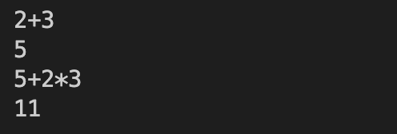

### Test case #2: 带括号的加法乘法


### Test case #3: 变量命名和应用

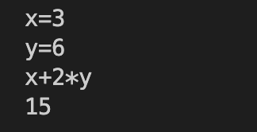

### Test case #4: 开根函数

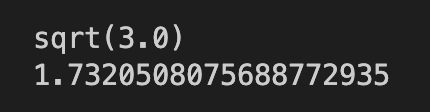

### Test case #5: 高精度加减法

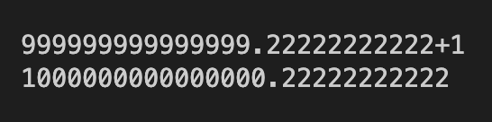

### Test case #6: 应用系统变量的简单计算

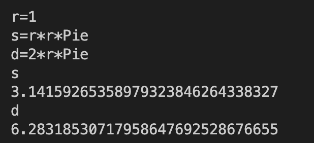

### Test case #7: 除法的应用

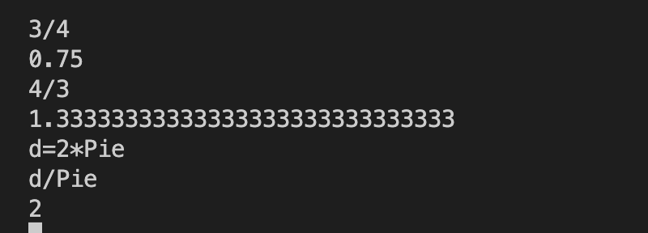

### Test case #8: 欢迎语句

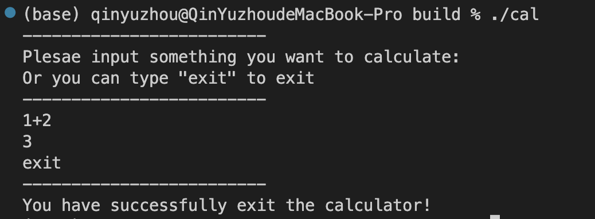

### Test case #9: 乘方计算

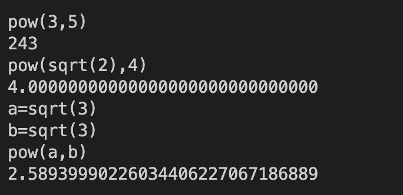

### Test case #10: 较大值和较小值计算

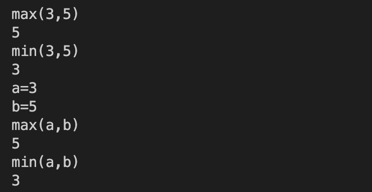

### Test case #11: 绝对值计算

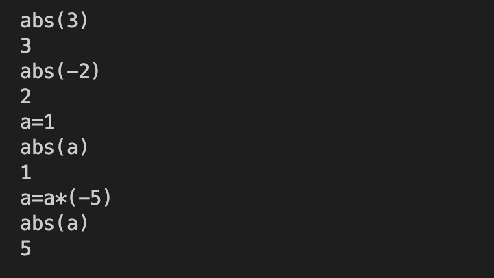

### Test case #12: 科学输入法输入与输出

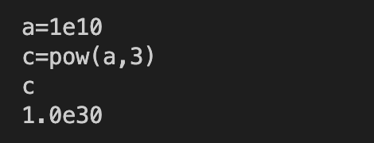

## Part 4 - Difficulties & Solutions

-----

### 深拷贝的使用

&emsp;&emsp;在添加了析构函数后，经常会出现因为一个函数结束，导致其内存被清理，但是C++默认的拷贝为浅拷贝，所以返回值的空间也会被清理掉，于是我有重写了拷贝函数和赋值函数以及针对右值的拷贝函数和赋值函数，并使用了深拷贝方法，这样就可以得到正常的结果。

### 除法的计算

&emsp;&emsp;在写除法时刚开始用的是试商法，时间复杂度是$O(n^2)$。之后采用了二分答案的方法，二分答案并检查答案与除数相乘后和被除数的大小关系来逐渐缩小范围，时间复杂度是$O(n{logn}^2)$。最后使用了牛顿迭代法，用主定理计算可知时间复杂度为$O(nlogn)$。

### 圆周率的计算

&emsp;&emsp;在开始计算圆周率时我使用的是莱布尼茨级数进行迭代，但是因为收敛速度太慢，迭代速度过慢，导致需要迭代很长时间，后来改用莱布尼茨级数的欧拉变换，将收敛速度和迭代速度提高了不少。

### 开始时运行时间较长

&emsp;&emsp;在开始输入之前，我的程序会预先计算圆周率和自然底数，导致在开始时会先停滞一段时间。

### 析构函数的使用

&emsp;&emsp;刚开始我并没有重写析构函数函数，在这周四听于老师讲完内存管理后才知道需要重写析构函数，于是就重写了析构函数并在析构函数中释放内存。
